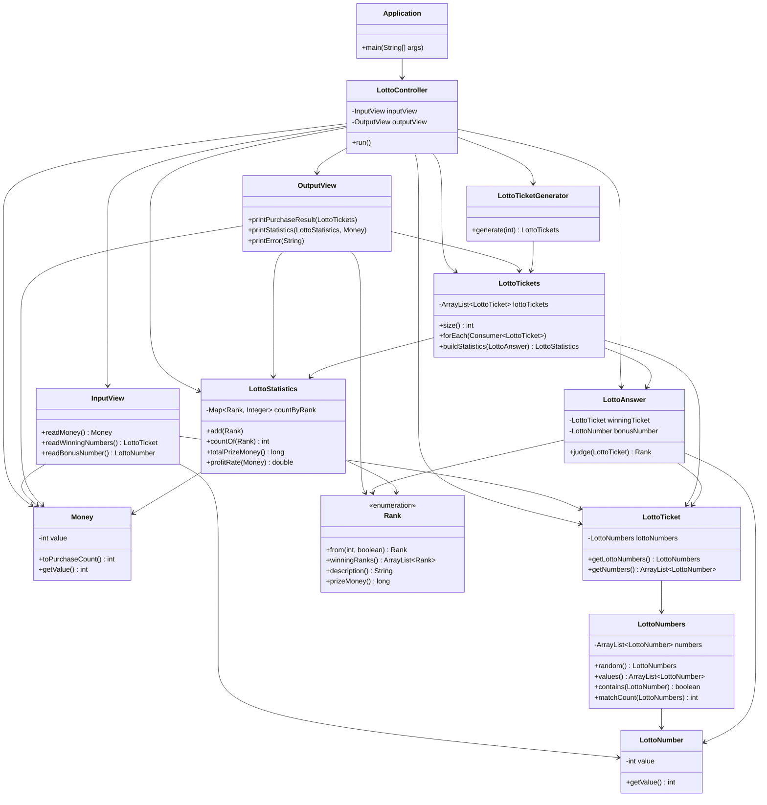

# Lotto

## 클래스별 설명

- `Application`: 프로그램 진입점이다. `LottoController`를 생성하고 `run()`을 호출한다.
- `LottoController`: 입력, 발급, 당첨 판정, 통계 출력까지 전체 흐름을 제어한다. 입력/검증 예외 발생 시 재입력을 유도한다.
- `InputView`: 콘솔 입력을 담당한다. 구입 금액, 당첨 번호, 보너스 번호를 읽고 파싱한다.
- `OutputView`: 콘솔 출력을 담당한다. 구매 결과, 당첨 통계, 수익률, 에러 메시지를 출력한다.
- `Money`: 구입 금액 값 객체다. 1000원 이상/1000원 단위 검증과 구매 가능 티켓 수 계산을 담당한다.
- `LottoNumber`: 로또 번호 값 객체다. 1~45 범위를 검증하고 동등성 비교를 제공한다.
- `LottoNumbers`: 로또 번호 6개를 감싸는 일급 컬렉션이다. 개수/중복 검증, 정렬, 랜덤 생성, 포함 여부 및 일치 개수 계산을 담당한다.
- `LottoTicket`: 로또 한 장을 표현한다. 내부적으로 `LottoNumbers`를 보유한다.
- `LottoTicketGenerator`: 구매 수량만큼 자동 생성된 `LottoTicket`을 만들어 `LottoTickets`로 반환한다.
- `LottoTickets`: 여러 장의 로또 티켓을 감싸는 일급 컬렉션이다. 순회, 개수 조회, 통계 집계를 담당한다.
- `LottoAnswer`: 당첨 티켓과 보너스 번호를 보관한다. 티켓 한 장의 당첨 등수를 `judge()`로 판정한다.
- `Rank`: 당첨 등수 enum이다. 등수 설명/상금을 보유하고 일치 개수+보너스 여부로 등수를 계산한다.
- `LottoStatistics`: 등수별 당첨 개수를 집계한다. 등수 카운트 조회, 총 당첨금, 수익률 계산을 담당한다.

## Class Diagram

